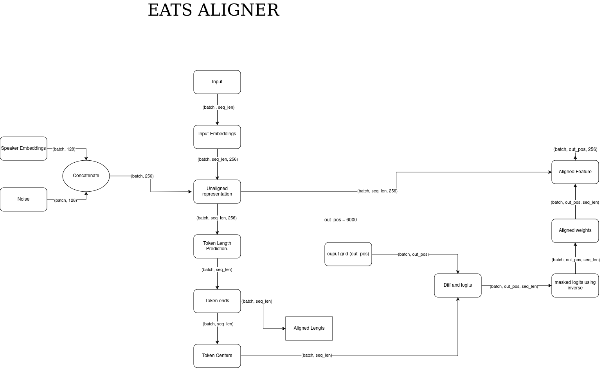

# END to END Adversarial Text To Speech ( Latest )
Learning To synthesize Speech from normalized text or phonomized text in a end to end manner.

Components :
- Feed Forward aligner architecture that predicts the duration of each input token --> audio aligned representation.
- A Dynamic Time Wraping based prediction loss.
- A Decoder to generate wav-form.

## Method
For this model, the input is `raw text` / `phonemes` , and output is `wavform`. This task is so challenging because we don't know that which input token will corresponding to the which output token.

To address this, there is a generator (differentiable) which divided into 2 Componets.
1. Aligner  -- It will gives a representation from input sequence which is aligned with the output wavform 

2. Decoder  -- upsample the representation from aligner to output a wavform.

**Multi-Speaker Training**
    
        - Speaker Conditional by feeding in a speaker embeddings along side a latent vector 'z' to enable training on a larger dataset

        